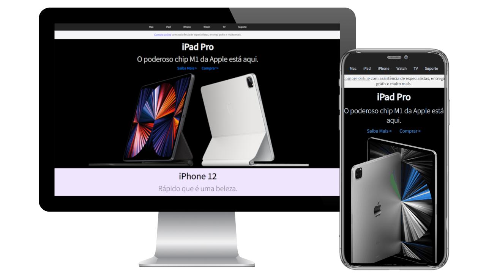

# Clone Apple

Este é um projeto extremamente simples. 
A minha única intenção com este repositório é estudar as seguintes tecnologias:
- HTML5
- CSS3
- SASS/SCSS

Para visualizar o projeto basta cloná-lo e abrir o arquivo copyApple.html dentro do diretório www/templates.

A única página que clonada foi a Homepage, nenhuma outra além dessa será feita. O projeto já esta finalizado. Sinta-se livre para analisá-lo para estudo e copiar o que julgar interessante.

Uma prévia da visualização pode ser vista abaixo:

